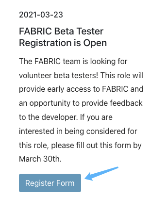

# FABRIC Facility Updates

## API Endpoints

- GET, POST: `/updates`
- PATCH, DELETE: `/updates/{uuid}`

## Data structure

Database format:

- active
- id
- uuid
- created
- created_by
- modified
- modified_by
- portal_id
- portal_title
- portal_content
- portal_date
- portal_link
- portal_button
- start
- end


Response format:

- id
- title
- content
- date
- link
- button


## Notes

### Portal Example

Reference: [src/services/fakeFacilityUpdates.js]()

```js
updates = [
    {
        id: 3,
        title: "FABRIC Beta Tester Registration is Open",
        content: "The FABRIC team is looking for volunteer beta testers! This role will provide early access to FABRIC and an opportunity to provide feedback to the developer. If you are interested in being considered for this role, please fill out this form by March 30th.",
        date: "2021-03-23",
        link: "https://share.hsforms.com/1VKIcNubyQ-eZYNnnivHSSQ3ry9k",
        button: "Register Form",
    }
]
```


